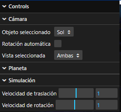
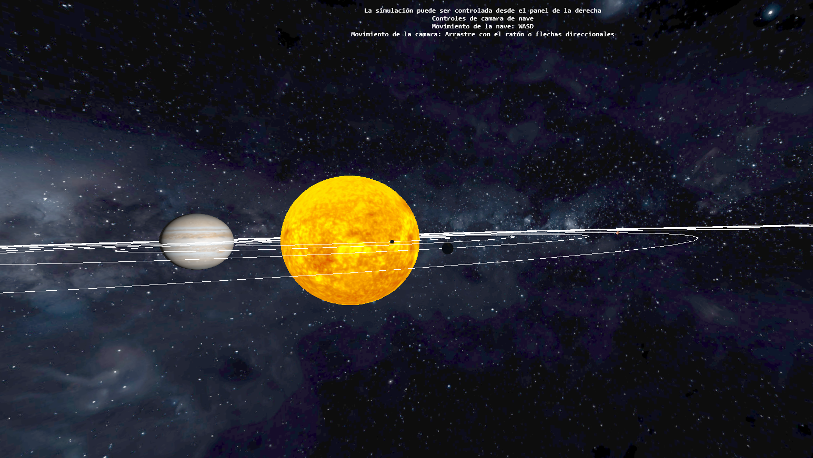
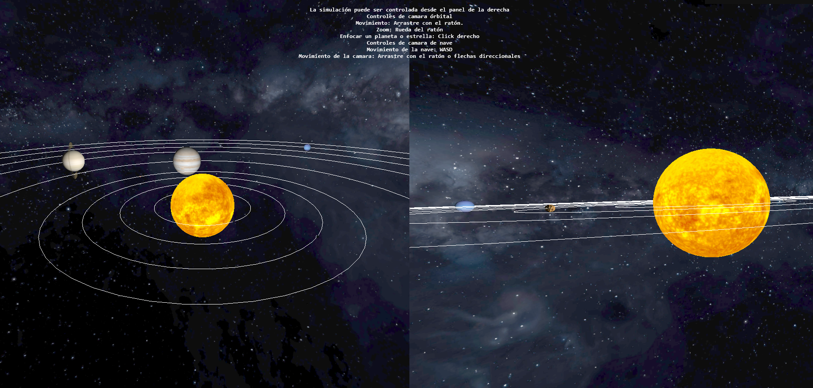
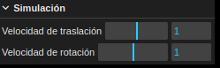

# Visor del Sistema Solar
## Agustín Alfonso González Iríbar

Simulación del sistema solar realizada con _three.js_ en la que se encuentran simulados el sol y todos los planetas del Sistema Solar (incluido Plutón).

A continuación se realiza una descripción del trabajo realizado:

- Se han representado todos los planetas del sistema solar, utilizando las texturas obtenidas de los enlaces en las referencias.
- Se han representado las órbitas de los distintos planetas.
- Se ha implementado una cámara órbital alrededor de los planetas y una cámara de nave.
- Se ha implementado el puerto de vista de forma que se pueden visualizar las dos cámaras al mismo tiempo.
- Se ha implementado un selector para poder poner el foco de la cámara orbital en un planeta, así como pulsar el propio planeta con el botón derecho del ratón mediante un raycaster.
- Se ha añadido luz puntual para representar la luz del sol y luz ambiente para representar la luz del espacio exterior y ver mejor los planetas.
- Se ha añadido un selector para activar y desactivar la rotación automática de la cámara orbital.
- Se ha implementado la posibilidad de rotar los anillos de Saturno y Urano.
- Se ha implementado la posibilidad de modificar la velocidad de traslación y rotación de los planetas.
- Se ha añadido un skybox para dar más realismo a la simulación.

## Acceso a la versión web y a vídeo demostrativo

La versión web de este proyecto se encuentra en [este sandbox de codesandbox](https://26tf22.csb.app/).

El código se puede acceder desde [este enlace](https://codesandbox.io/p/sandbox/planetas-26tf22).

Un vídeo demostrativo de la simulación puede ser encontrado en [este enlace](https://youtu.be/pOSvFZ6s_CU).

## Ejecución del proyecto en local

A continuación, se detallan las instrucciones de ejecución del proyecto de forma local en caso de que la version web fallara.

1. Descargar o clonar el repositorio


2. Descargar e instalar la version mas reciente de ``Node.js`` desde [este enlace](https://nodejs.org/en)

3. Para asegurar que la instalación se realizó correctamente utilizar los siguientes comandos en un terminal o símbolo del sistema:

```
node --version
npm --version
```

4. Una vez correctamente instalado ejecutar el siguiente comando desde un terminal o símbolo del sistema en el directorio o carpeta en el que se encuentre el proyecto:

```
npm install
```

5. Una vez termine el comando anterior ejecutar el siguiente comando desde el mismo terminal o simbolo del sístema:

```
npm run start
```

6. Una vez ejecutado este comando se observará en la consola algo parecido a esto:
```
> planetas-agustin@1.0.0 start
> parcel ./src/index.html

Server running at http://localhost:1234
```

7. Abrir un navegador y, en la barra de direcciones, escribir ```localhost:1234```

8. Para terminar la simulación, pulsar la combinación de botones ```Ctrl + C``` en la consola donde se realizó el paso 5


## Controles de la simulación

La simulación incluye un panel de control con diferentes opciones explicadas a continuación.



### Controles de cámara

Se han implementado dos tipos de camara para la simulación: una `cámara orbital` y una `cámara de nave`. Para cambiar el tipo de camara se hace uso del selector denominado _Vista seleccionada_. En este selector se puede seleccionar los dos modos de camara mencionados además de un tercer modo en el que se muestran las dos cámaras a la vez, quedando la orbital a la izquierda y la de la nave a la derecha.

#### Cámara orbital


En este modo la cámara _orbita_ alrededor de alguno de los objetos presentes en la simulación. Se puede mover la camara arrastrando el ratón por la pantalla. Además se puede hacer _zoom_ utilizando la rueda del ratón hacía delante para aumentarlo y hacía atrás para disminuirlo.

Se puede seleccionar el objeto sobre el que orbita la cámara pulsando con el botón derecho del ratón sobre el objeto deseado o seleccionándolo en el selector denominado _Objeto seleccionado_.

También se puede activar la rotación automática marcando la casilla _Rotación automática_.


#### Cámara de nave



En este modo la cámara se mueve libremente sobre la escena. Para mover la camara se utilizan las teclas _WASD_ y, para rotar se puede arrastrar con el ratón o utilizar las _teclas direccionales_.

#### Cámara múltiple


Como se ha comentado previamente, la simulación incluye un modo en el que se puede observar la escena desde ambas cámaras.

En la parte superior de la pantalla se incluyen las instrucciones para manejar las camaras seleccionadas.

### Controles de velocidad de rotación y traslación


La interfaz de usuario incluye unos selectores que permiten modificar la velocidad de _traslación_ y _rotación_ de todos los objetos presentes. 

### Otras funcionalidades
#### Rotación de los anillos de los planetas


Al seleccionar un planeta con anillos (`Saturno` o `Urano`) aparecerá en la sección _Planetas_ de la interfaz de usuario unos selectores que permitirán modificar la rotación del anillo de dicho planeta en X, Y, y Z.

## Referencias
Todas las texturas, mapas de rugosidad, mapas de transparencia, mapa de reflexión especular de la Tierra y skybox han sido sacados de:

- [PlanetPixelEmporium](http://planetpixelemporium.com/planets.html).
- [SolarSystemScope](https://www.solarsystemscope.com/textures/).

Para convertir la textura del skybox en CubeMap se ha utilizado la siguiente [herramienta](https://github.com/matheowis/HDRI-to-CubeMap).